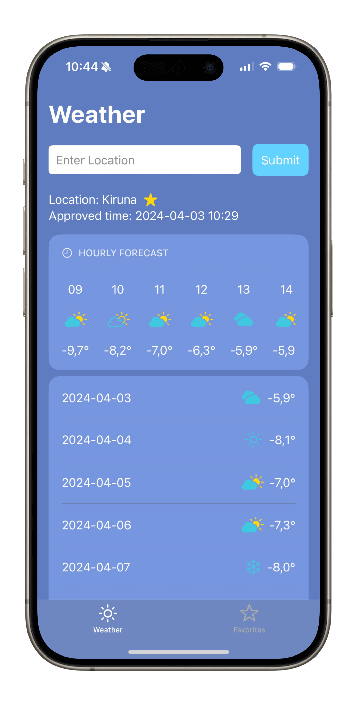
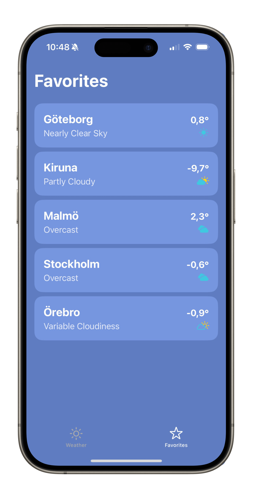
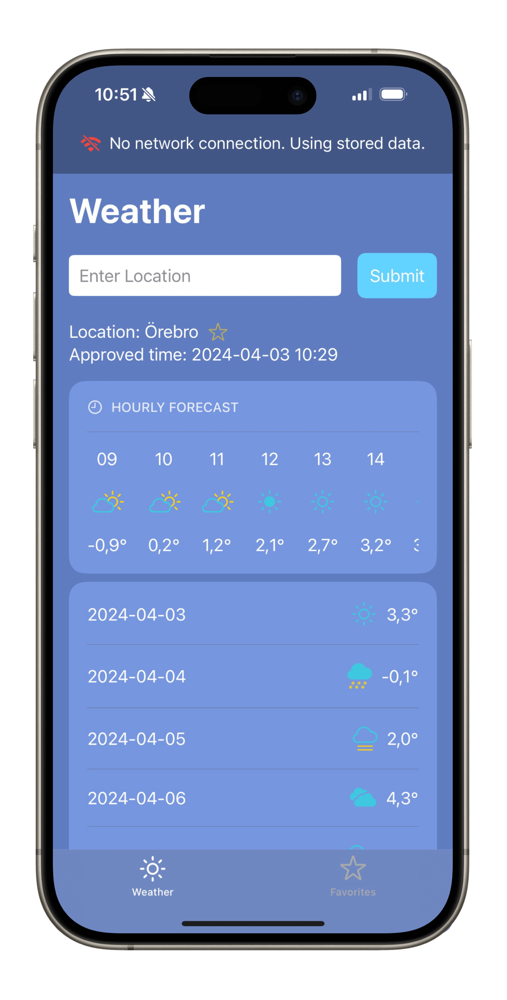

# Weather App

A simple iOS weather app that uses the SMHI Open Data API and a geocoding API from Map Maker.

Serialized JSON is used for persistence.

This project was part of a mobile applications and wireless networks course at KTH Royal Institute of Technology.

  
  
  

